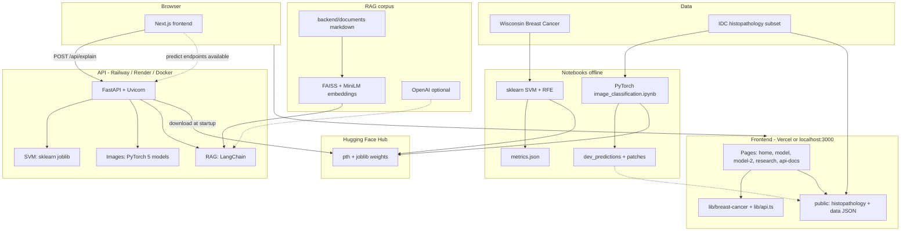

# TumorSense

Interactive full-stack workshop for breast cancer classification: **Wisconsin (WDBC) SVMs** on tabular FNA features and **PyTorch CNNs / ViT** on IDC histopathology patches. Includes research dashboards, explainable AI (RAG, saliency, PCA), and a FastAPI backend deployable to **Railway** with weights on **Hugging Face Hub**.

---

## Architecture

> **Tip:** GitHub renders the diagrams below on the repo README page. If Mermaid does not appear in your editor preview, open the file on github.com or use a Mermaid-capable viewer.

### End-to-end system



---

## Overview


| Layer       | Technology                                                                     | Role                                 |
| ----------- | ------------------------------------------------------------------------------ | ------------------------------------ |
| Frontend    | Next.js 15, React, TypeScript, Tailwind, shadcn/ui, Lucide, Three.js, Recharts | Workshops, research UI, API docs     |
| Backend     | FastAPI, Uvicorn, Pydantic                                                     | SVM + image inference, RAG           |
| ML training | Jupyter, scikit-learn, PyTorch, torchvision, timm                              | Fit models, export metrics           |
| Weights     | Hugging Face Hub                                                               | Host joblib and pth files not in git |
| Deploy      | Vercel (UI), Railway or Render (API), optional GHCR image                      | Production                           |


---

## Datasets and experiments

### Wisconsin Breast Cancer (WDBC) — SVM

- **569** fine-needle aspirates, **30** features; UI exposes **10 mean** features after RFE.
- Kernels: **linear, RBF, polynomial, sigmoid** with grid search.
- Outputs: `backend/outputs/svm_out/metrics.json` (in git), `model_*.joblib` + `scaler.joblib` (on HF).
- Site: live decision-boundary workshop, confusion matrix, learning curves, optional `POST /api/predict`.

### IDC histopathology — deep learning

- **36** class-balanced **50×50** RGB patches in `public/histopathology/`.
- **5** architectures: BaselineCNN, VGG-16, MobileNet-V2, ResNet-18, ViT-Tiny (`image_classification.ipynb`).
- **Patient 9344** whole-slide probability landscape (ResNet-18 overlays on stitched tissue).
- Precomputed: `public/data/gallery_predictions.json` for all models × all gallery patches.

---

## Webpages


| Route       | Description                                                                                                                            |
| ----------- | -------------------------------------------------------------------------------------------------------------------------------------- |
| `/`         | Landing — about, motivation, results                                                                                                   |
| `/model`    | SVM workshop — sliders, 2D feature space, stats, **RAG** via button                                                                    |
| `/model-2`  | Image workshop — gallery, leaderboard, 3D arch, forward pass, saliency, embeddings, eigen-patches, probability landscape, segmentation |
| `/research` | Background, EDA, RFE; tabs for ML/XAI, statistics, case studies                                                                        |
| `/api-docs` | API reference and curl examples                                                                                                        |


---

## API

Base URL: `NEXT_PUBLIC_API_URL` (default `http://localhost:8000`). Swagger: `/docs`.


| Method | Path                      | Description              |
| ------ | ------------------------- | ------------------------ |
| GET    | `/health`                 | Status and loaded models |
| GET    | `/api/models`             | SVM kernels              |
| GET    | `/api/feature-names`      | 10 feature names         |
| GET    | `/api/metrics`            | Training metrics JSON    |
| POST   | `/api/predict`            | SVM inference            |
| GET    | `/api/image/models`       | Image model list         |
| POST   | `/api/image/predict`      | Image inference (base64) |
| POST   | `/api/image/predict-file` | Image inference (upload) |
| POST   | `/api/explain`            | RAG explanation          |


Wired in the UI today: `**POST /api/explain`** (on button press). SVM and image predict endpoints are implemented; the workshops primarily use client logic and static JSON for responsiveness.

---

## Repository layout

```
app/                 # Next.js routes
components/          # landing, model, model-2, research, api-docs, ui (shadcn)
lib/                 # api.ts, breast-cancer mocks and helpers
public/              # histopathology patches, precomputed JSON
backend/             # FastAPI, RAG docs, scripts, Dockerfile, DEPLOY.md
image_classification.ipynb
render.yaml          # optional Render blueprint
```

---

## Getting started

### Frontend

```bash
npm install
npm run dev
```

`.env.local` (optional):

```env
NEXT_PUBLIC_API_URL=http://localhost:8000
```

### Backend

From **repo root**:

```bash
python -m venv backend/.venv
source backend/.venv/bin/activate
pip install -r backend/requirements.txt
cp backend/.env.example backend/.env
uvicorn backend.server:app --reload --port 8000
```

Place trained weights in `backend/models/` or set `TUMORSENSE_WEIGHTS_BASE_URL` after uploading to Hugging Face.

---

## Deployment

1. Upload `backend/models/` to a **public** HF repo (`hf auth login`, `hf upload …`).
2. Deploy API to **Railway** (Dockerfile or GHCR image) or **Render** (`render.yaml`).
3. Set `TUMORSENSE_WEIGHTS_BASE_URL`, `TUMORSENSE_CORS_ORIGINS`, optional `OPENAI_API_KEY`.
4. Deploy frontend to Vercel with `NEXT_PUBLIC_API_URL` pointing at the API host.

Details: **[backend/DEPLOY.md](backend/DEPLOY.md)**

---

## Environment variables


| Variable                      | Where    | Purpose             |
| ----------------------------- | -------- | ------------------- |
| `NEXT_PUBLIC_API_URL`         | Frontend | API base URL        |
| `TUMORSENSE_WEIGHTS_BASE_URL` | Backend  | HF weights base URL |
| `TUMORSENSE_CORS_ORIGINS`     | Backend  | CORS allowlist      |
| `OPENAI_API_KEY`              | Backend  | LLM RAG (optional)  |


---

## Disclaimer

Demonstration and coursework only — not for clinical diagnosis. Third-party datasets and papers retain their original licenses and citations.